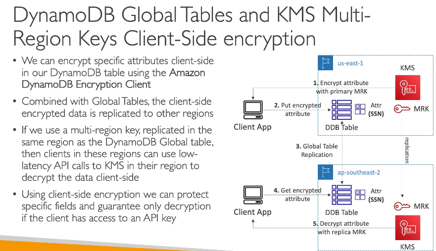
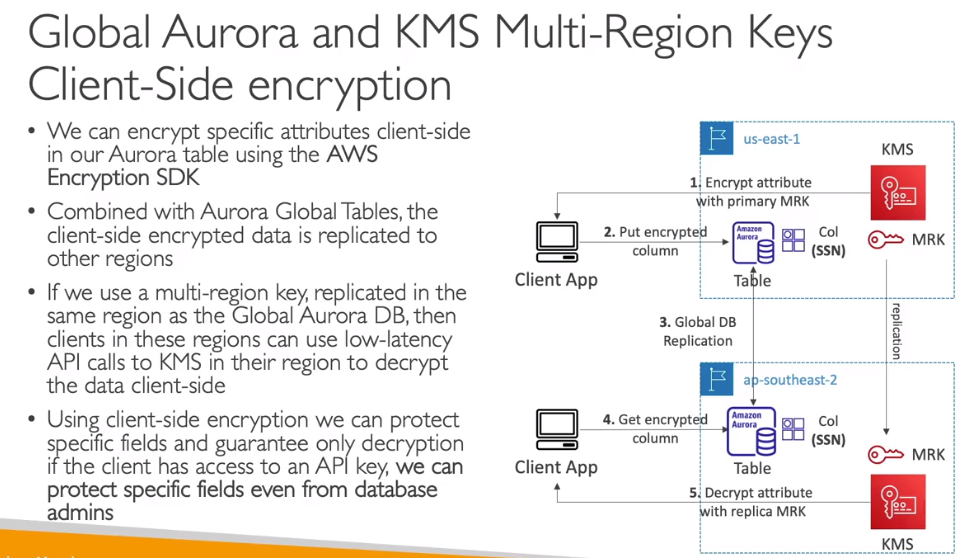

#KMS - Key Management Service

### Key Types:

**_Symmetric (AES-256 keys)_**

- Single encryption key that is used to Encrypt and Decrypt
- AWS services that are integrated with KMS use Symmetric CMKs
- Never get access to KMS Key unencrypted (must call KMS API to use)

**_Asymmetric (RSA & ECC key pairs)_**

- Public (Encrypt) and Private Key (Decrypt) pair
- Used for Encrypt/Decrypt - Sign/Verify operations
- The public key is downloadable, but you can't access the Private Key unencrypted

> Use case: Encryption outside of AWS by users who can't call the KMS API

### Types of KMS Keys:

- AWS Owned Keys (free): SSE-S3, SSE-SQS, SSE-DDB (default key)
- AWS Managed Key (free): aws/service-name -> Example: aws/rds or aws/ebs
- Customer managed keys created in KMS
- Customer managed keys import (must be symmetric key)

### Automatic Key Rotation:

- Automatic every 1 year
- Customer-managed KMS Key (must be enabled): automatic every 1 year
- Imported KMS Key: only manual rotation possible using alias

### KMS Key Policies:

- Control access to KMS Keys
- Similar to S3 bucket policies - Different: Can not control access without them

- Default KMS Key Policy:
  - Created if you don't provide a specific KMS Key Policy
  - Complete access to te key to the root user = entire AWS account
- Custom KMS Key Policy:
  - Define users, roles that can access the KMS Key
  - Define who can administer the key
  - Useful for cross-account access of your KMS Key (different account)

### KMS Multi-Region Keys:

- Encrypt in one Region and decrypt in other Regions
- KMS Multi-Region are **NOT GLOBAL** (Primary + Replica)
- Each Multi-Region key is managed independently

Use Cases: Global client-side encryption, encryptionon Global DynamoDB, Global Aurora

- DynamoDB:
  - 
- Aurora:
  - 

### S3 Replication Encryption

- Unencrypted objects and objects encrypted with SSE-S3 are replicated by default
- Objects encrypted with SSE-C (customer provided key): are never replicated

- Object encrypted with SSE-KMS:
  - Specify which KMS Key to encrypt objects
  - Adapt the KMS Key Policy for the target key
  - An IAM Role with kms:Decrypt for source KMS Key and kms:Encrypt for the target KMS Key

### Encrypted AMI Sharing Process

1. AMI in Source Account is encrypted with KMS Key
2. Must modify the image attribute to add a **Launch Permission** which corresponds to the specified target AWS account
3. Must share the KMS Keys used to encrypted the snapshot the AMI references with the target account / IAM Role
4. THE IAM Role/User in the target account must have the permissions to **DescribeKey**, **ReEncrypted**, **CreateGrant**, **Decrypt**
5. When lauching an EC2 instance from the AMI, optionally the target account can specify a new KMS key in its own account to re-encrypt the volumns
